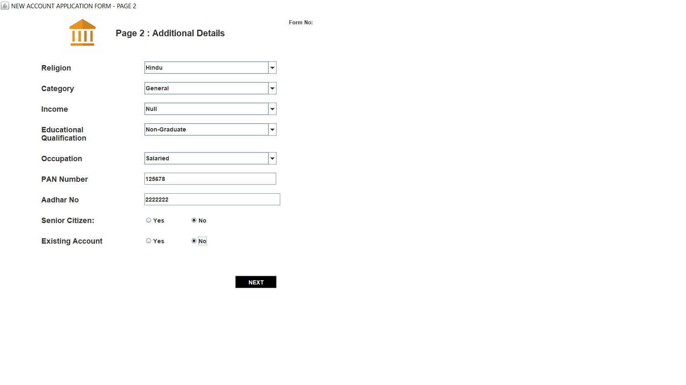
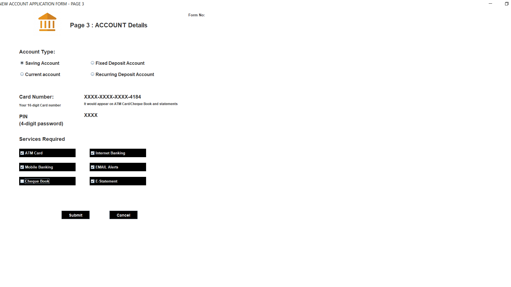
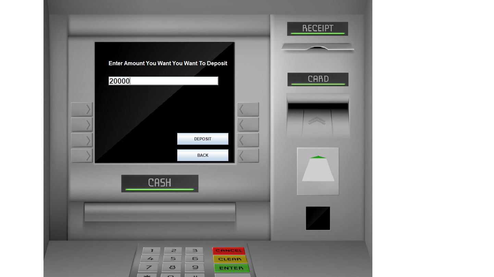
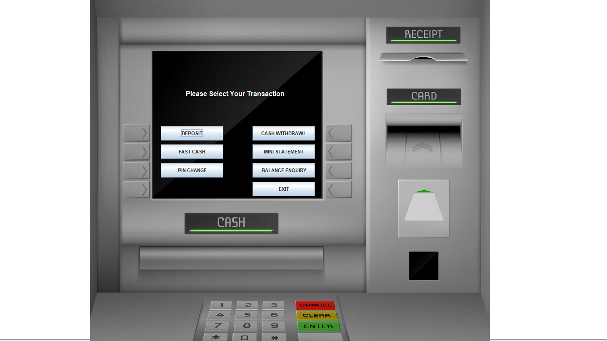
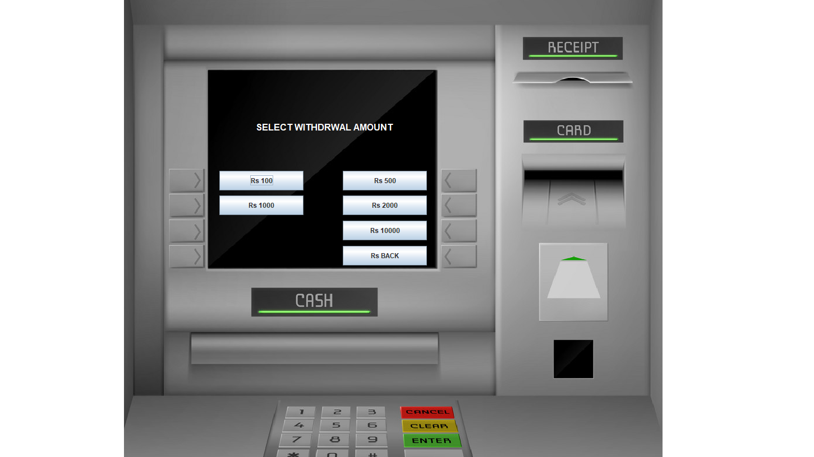
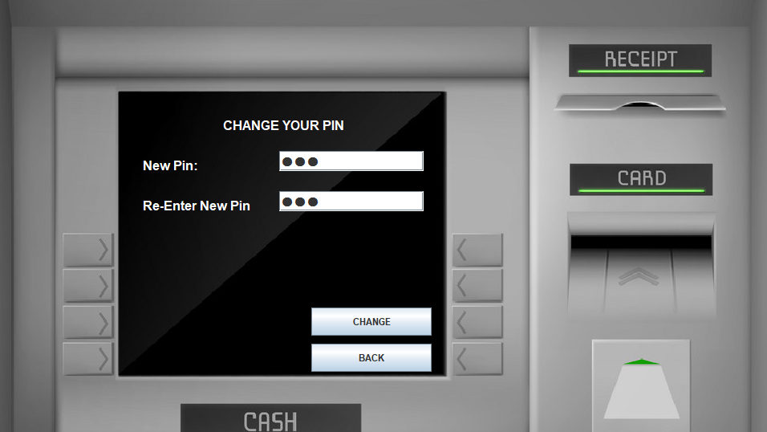
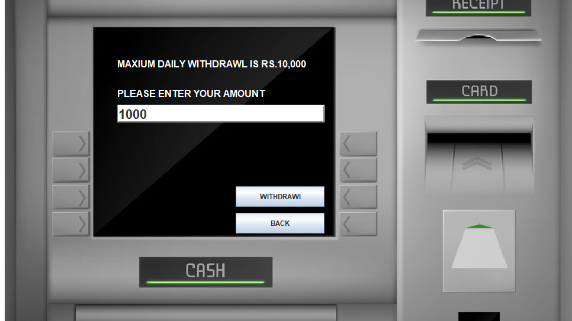

# ATM-Simulator-System
ATM Simulator System is a desktop based application that can be used by Customers for ATM related transactions.

***

<h3>Objective</h3>
<ul>
    <li>ATM Simulator System is a desktop based application that can be used by Customers for ATM related transactions.</li>
</li>
</ul>

*** 

<h3>Technologies Uses :</h3>
<ol>
    <li>Core Java </li>
    <li>Java - Swing</li> 
    <li>MySQL</li>
    <li>IDE Used : Netbeans</li>
</ol>

***

<h3> Screenshots</h3>

    
    
    
    
    
    

    
    
    

